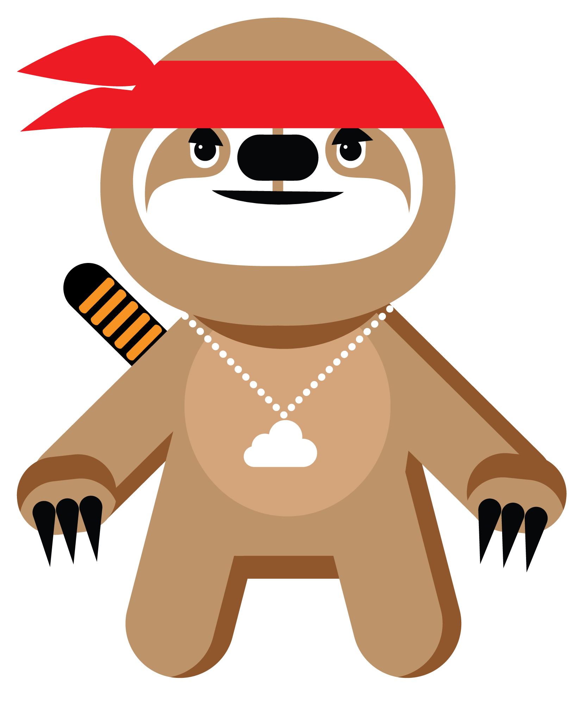

# Meet Brady

This is Brady, the *Open Cloud Ninja Sloth* created by the Azure open source marketing team at Microsoft.

You might have encountered Brady in the wild at events around the world, and it's hard not to give in to its cuteness! Brady is an unoffical mascot for open source solutions running on [Microsoft Azure](http://azure.com) and we're proud to announce that, in true open source spirit, Brady's designs are now available on GitHub for everyone to remix them as they please.

Feel free to download the vector files and create your own adaptations of Brady. We've been using Brady for t-shirts, stickers, hoodies and more _swag_ at events, but we want to get it out in the open as much as possible. **If you adapt Brady into a new design, or into a new variant, you're welcome to share it with us by opening a PR!**

Brady was born at Microsoft as a fun project. It's not an official Microsoft logo, so we're making it available under a very permissive Creative Commons license; this means that you can do (almost) everything you want with it. When creating new designs that incorporate third-party brands or logos, however, please be mindful of their branding guidelines. Because Brady is not an official Microsoft logo, please do not combine it with first-party Microsoft logos or product icons.

Keep just one thing in mind… Don't get yourself fooled by how cute Brady looks: it's still a ninja, and it's mightier than you'd think 😉

## License

© Microsoft, 2017 
This work is licensed under a <a rel="license" href="http://creativecommons.org/licenses/by-nc-sa/4.0/">Creative Commons Attribution-NonCommercial-ShareAlike 4.0 International License</a>. 

